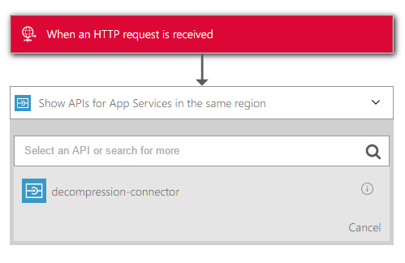
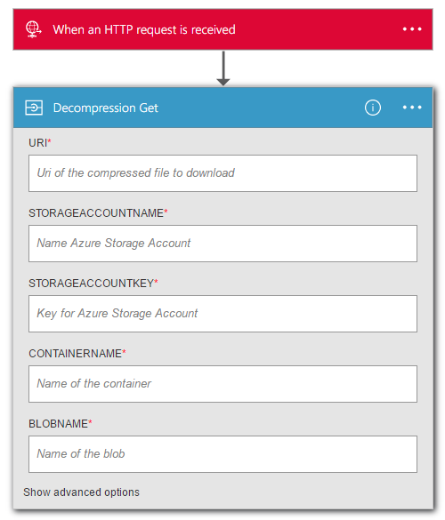

GZip Decompressor Azure API App
===================================================

Azure API App to download, decompress &amp; store a file on Azure Blob Storage.

> This API App stores the file directly on Azure Blob Storage because of the file size limitations in Azure Logic Apps. For more information, see the Logic App Limitations [here](https://azure.microsoft.com/en-us/documentation/articles/app-service-logic-limits-and-config/).

## Deploying the API App
To deploy the custom API App you can select one of the following options:

- Source Control Integration
- Web Deploy
- FTP or FTPS
- Kudu

More information can be found [here](https://azure.microsoft.com/en-us/documentation/articles/web-sites-deploy/).

## Integration with Logic Apps
Using the API app can be done in a few steps:

1. Create a new API App in the Azure Portal
2. Deploy the code to the API App
3. Create a new Logic App in the Azure Portal
	1. Add the trigger you want to use
	1. Add more steps, if applicable
	3. Select *"Show APIs for App Services in the same region* and choose your API App
	4. Configure the API App like you want

*Adding the API App to your Logic App*

*Configuring the API App*

## License information

> This is a reference implementation - We are not responsible for possible issues in real-world production environments

This is licensed under The MIT License (MIT). Which means that you can use, copy, modify, merge, publish, distribute, sublicense, and/or sell copies of the web application. But you always need to state that Codit is the original author of this web application.
